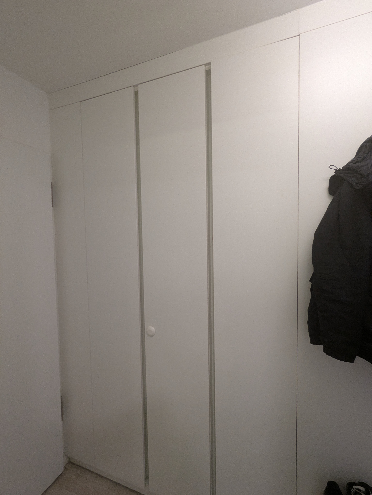
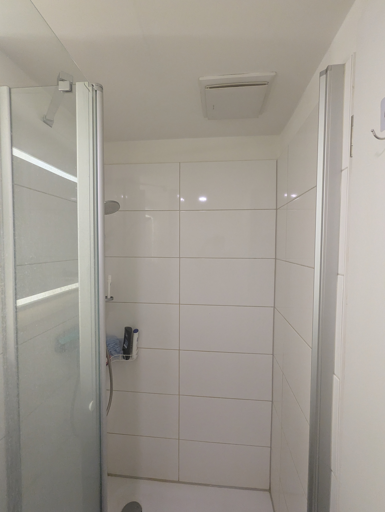
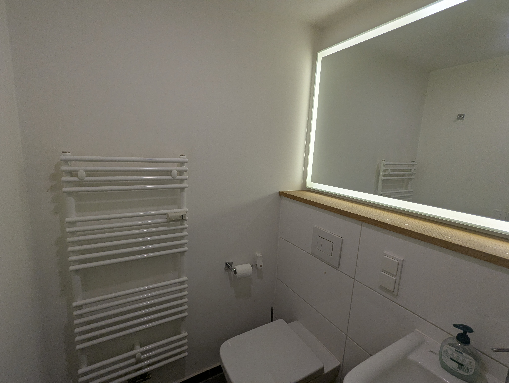
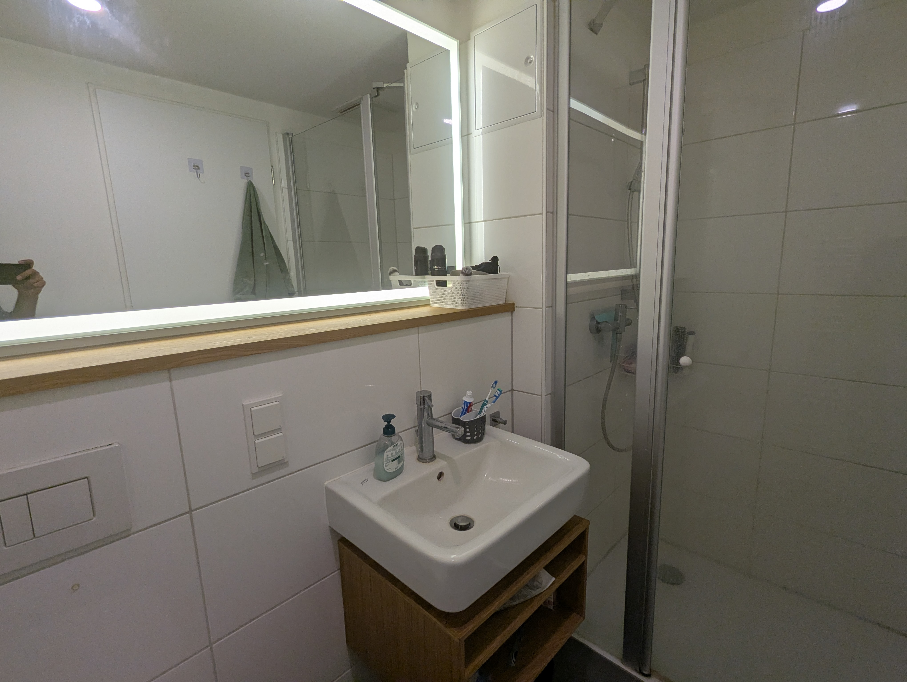
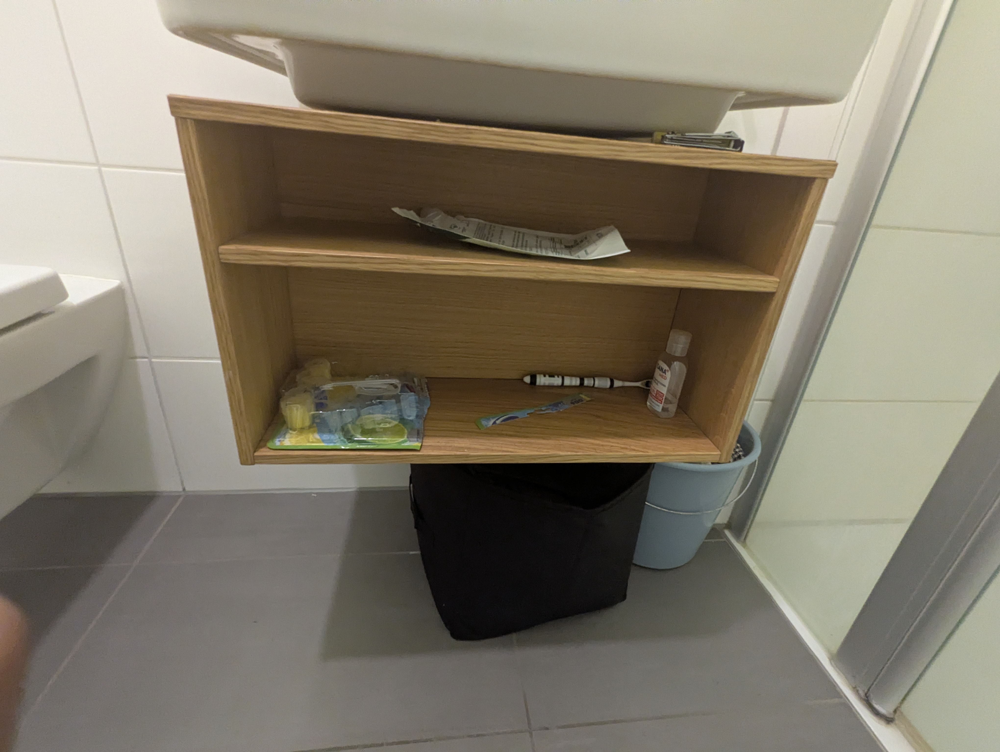
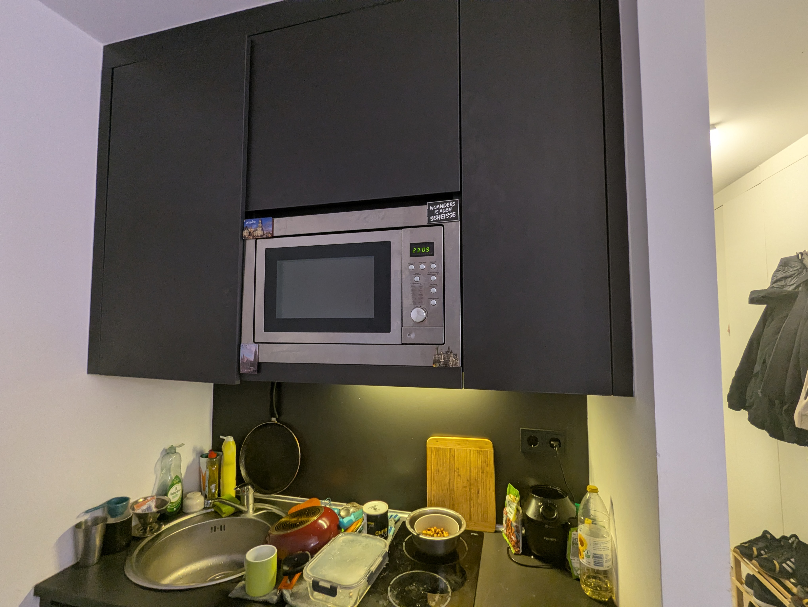
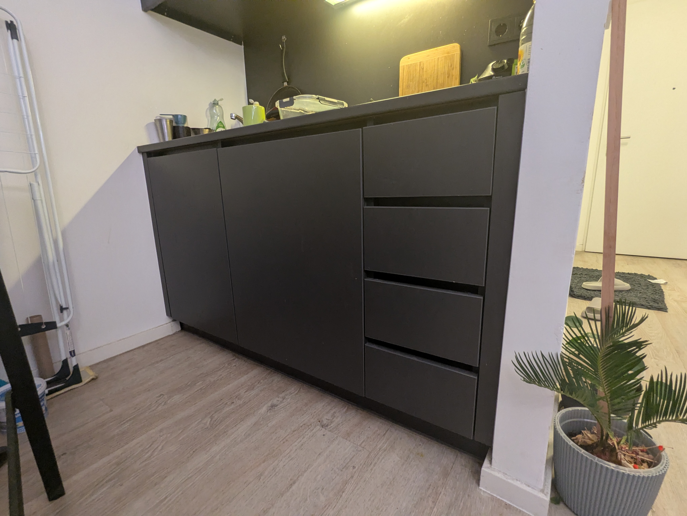

<!-- Restrict direct access unless coming from gallery -->

# Current photos

These are *recent real photos* of the apartment.  
Please note: the apartment is currently in use, so it may not appear fully clean and organized.

---

  <figure><figcaption>Bed</figcaption></figure>
  <figure><figcaption>Desk</figcaption></figure>
  <figure><figcaption>Wardrobe </figcaption></figure>
  <figure><figcaption>Mirror and coat hanger</figcaption></figure>
  <figure><figcaption>Shelf1</figcaption></figure>
  <figure><figcaption>Shelf2</figcaption></figure>
  <figure><figcaption>Shelf3</figcaption></figure>
  <figure><figcaption>bed head</figcaption></figure>
  <figure><figcaption>Shower</figcaption></figure>
  <figure><figcaption>Bathroom</figcaption></figure>
  <figure><figcaption>Still Bathroom</figcaption></figure>
  <figure><figcaption>bathroom storage</figcaption></figure>
  <figure><figcaption>kitchen up</figcaption></figure>
  <figure><figcaption>kitchen down</figcaption></figure>
  <figure><figcaption>kitchen side</figcaption></figure>

---

  &times;
  
  <a class="prev" onclick="changeImage(-1)">&#10094;</a>
  <a class="next" onclick="changeImage(1)">&#10095;</a>

---
[⬅ Back to Gallery](gallery.md)