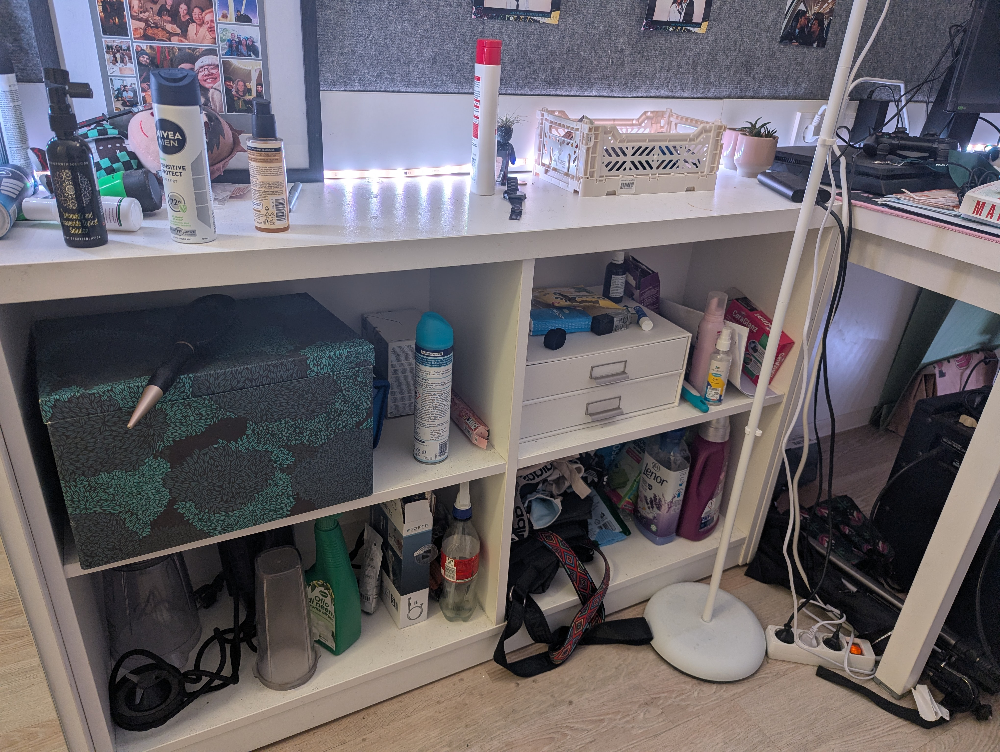
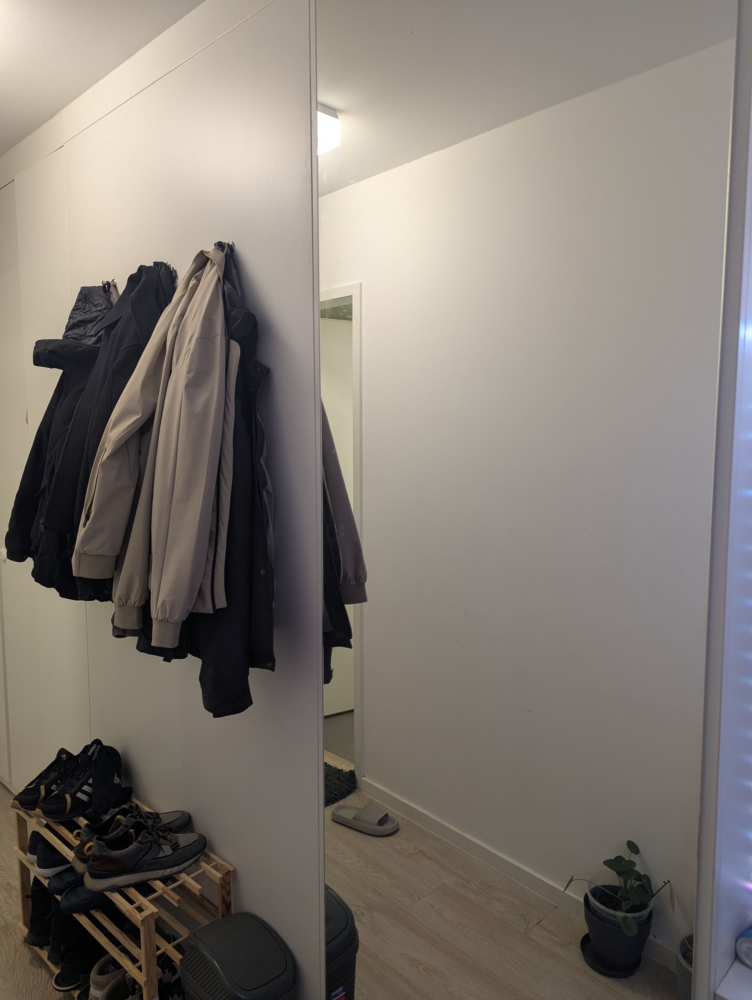
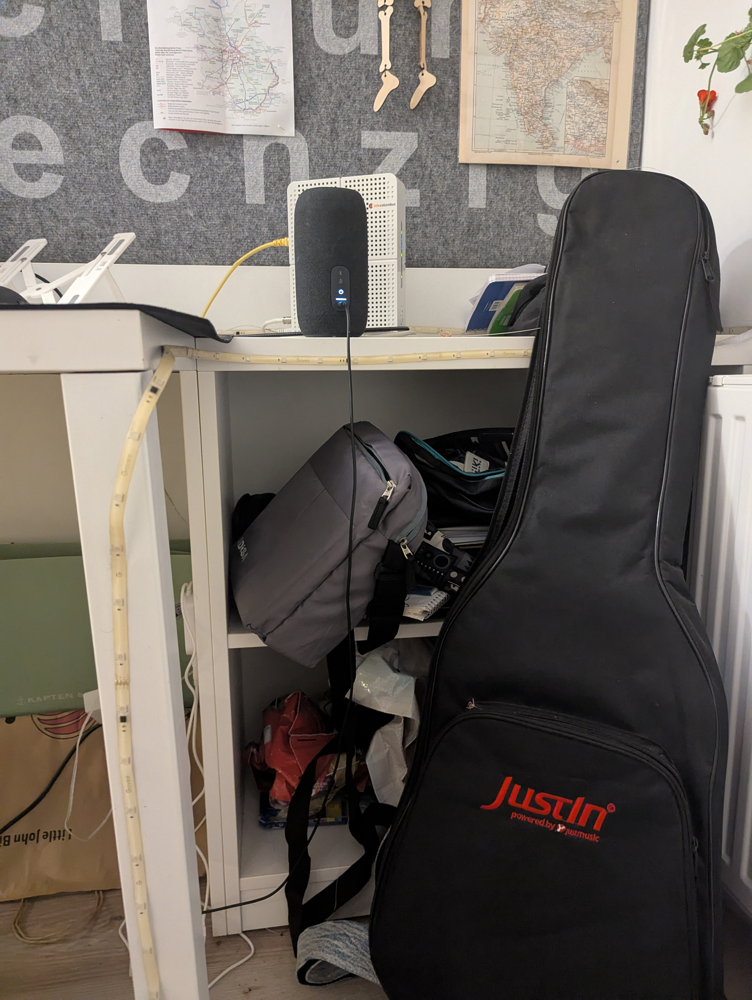
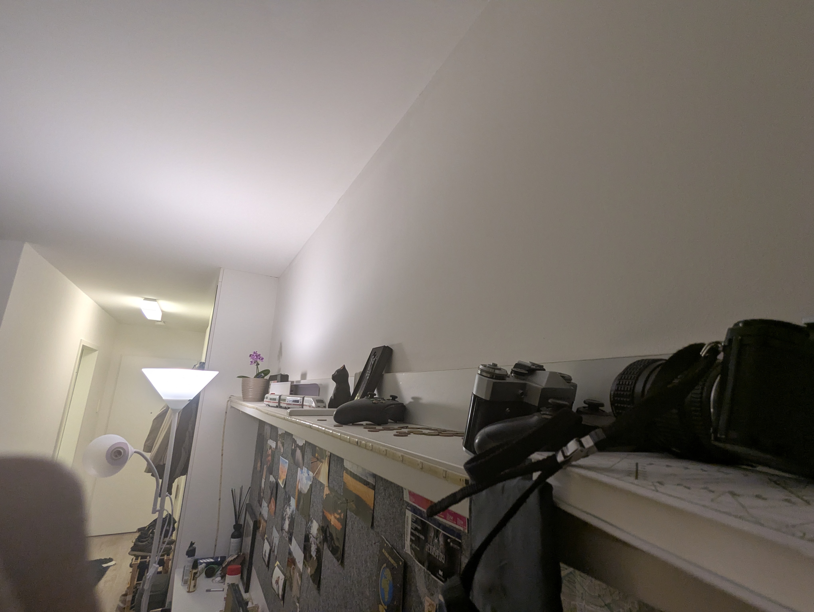

# Current photos

These are *recent real photos* of the apartment.  
Please note: the apartment is currently in use, so it may not appear fully clean and organized.

---

  <figure><figcaption>View 2 – desk and storage</figcaption></figure>
  <figure><figcaption>View 3 – wardrobe and miror</figcaption></figure>
  <figure><figcaption>View 4 – Desk </figcaption></figure>
  <figure><figcaption>View 5 – more storage</figcaption></figure>
  <figure><figcaption>View 6 – bed</figcaption></figure>
  <figure><figcaption>View 7 – bed</figcaption></figure>
  <figure><figcaption>View 8 – overall room layout</figcaption></figure>

---

---
[⬅ Back to Gallery](gallery.md)
