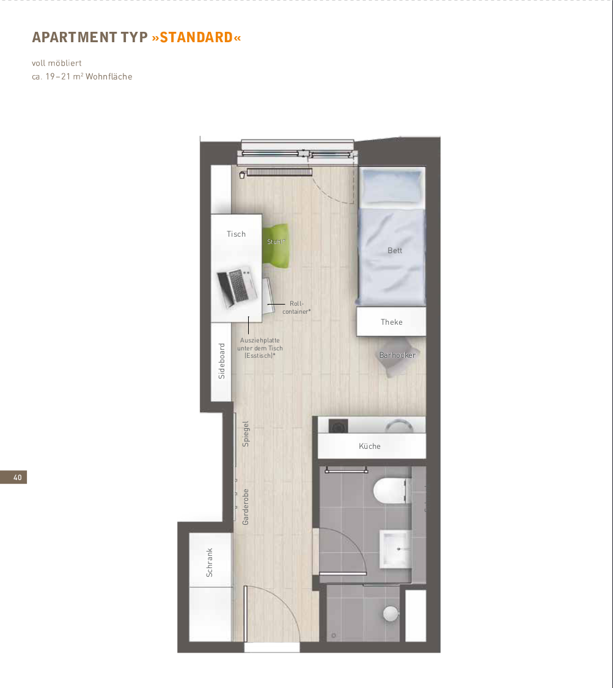
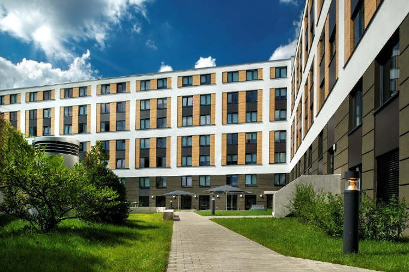
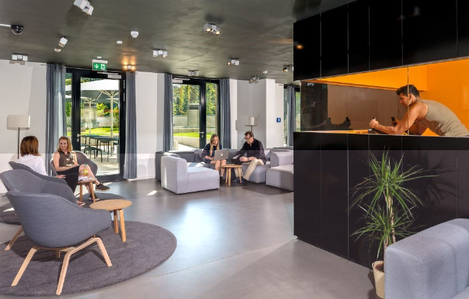
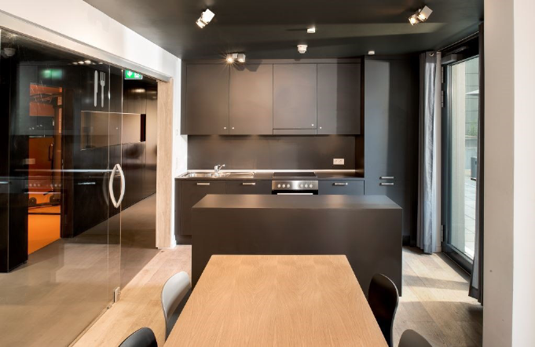
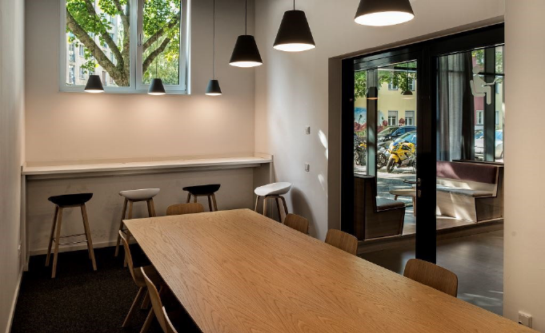
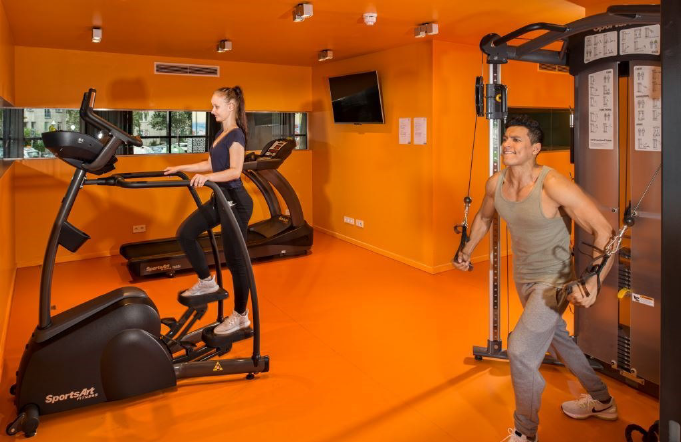
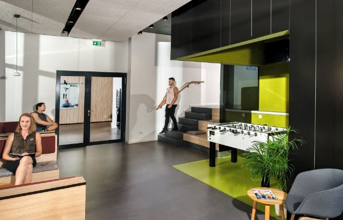

<script>
if (sessionStorage.getItem("authenticated") !== "true") {
  window.location.href = "login.html";
}
</script>


# Building exterior and floorplan

## Apartment Type: Standard



## Building features

The ground floor of the building has a common area with a study room, community kitchen and a small gym which is accessible to all residents. Attached here are the images of the common areas.

<!-- 🖼️ Begin Image Carousel -->

:::: carousel
::: slides
```         








```
:::

<button class="prev" onclick="moveSlide(-1)">❮</button> <button class="next" onclick="moveSlide(1)">❯</button>
::::

```{=html}
<style>
.carousel {
  position: relative;
  max-width: 600px;
  margin: 20px auto;
  overflow: hidden;
  border-radius: 10px;
  box-shadow: 0 4px 15px rgba(0,0,0,0.2);
}

.carousel img {
  width: 100%;
  display: none;
  border-radius: 10px;
}

.carousel img.active {
  display: block;
}

.carousel .prev,
.carousel .next {
  cursor: pointer;
  position: absolute;
  top: 50%;
  width: auto;
  padding: 12px;
  margin-top: -22px;
  color: white;
  font-weight: bold;
  font-size: 24px;
  background-color: rgba(0,0,0,0.4);
  border: none;
  border-radius: 50%;
  user-select: none;
  transition: 0.3s;
}

.carousel .next {
  right: 10px;
}
.carousel .prev {
  left: 10px;
}

.carousel .prev:hover,
.carousel .next:hover {
  background-color: rgba(0,0,0,0.7);
}
</style>
```

```{=html}
<script>
let slideIndex = 0;
const slides = document.querySelectorAll('.carousel img');

function showSlide(index) {
  slides.forEach((img, i) => {
    img.classList.toggle('active', i === index);
  });
}

function moveSlide(step) {
  slideIndex = (slideIndex + step + slides.length) % slides.length;
  showSlide(slideIndex);
}

// Initialize carousel
document.addEventListener('DOMContentLoaded', () => {
  showSlide(slideIndex);
});
</script>
```

<!-- 🖼️ End Image Carousel -->

------------------------------------------------------------------------

[⬅ Back to Home](index.md)